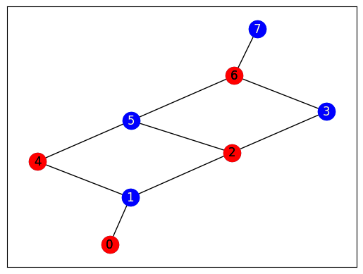

# Graph Mapping

The Ocean program uses the package ``dwave-networkx``.  D-Wave NetworkX is an extension of NetworkX—a
Python language package for exploration and analysis of networks and network
algorithms—for users of D-Wave Systems.  The base problem of this exercise is
the antenna selection problem from the [D-Wave Collection of
Examples](https://github.com/dwave-examples/antenna-selection).

## Exercise 2

Open ``change_problem.py``.  This file is identical to ``original_program.py``,
but is missing the following things:  (1) a graph definition, and (2) a graph
algorithm from ``dwave-networkx``.  Fill in the functions ``create_graph`` and
``solve_problem`` in this program to solve the minimum vertex cover on the
following graph.  

A vertex cover is a set of vertices such that each edge of the graph is incident with at least one vertex in the set. A minimum vertex cover is the vertex cover of smallest size.

## Running ``change_problem_solution.py``. 
The output is as follows:

---

Minimum vertex cover size found is 4

[0, 4, 2, 6]

Your plots are saved to vertex_cover_original.png and vertex_cover_solution.png

---

#### Original

#### Solution

A second alternate output is as follows:

---

Minimum vertex cover size found is 4

[1, 5, 3, 7]

Your plots are saved to vertex_cover_original.png and vertex_cover_solution.png

---

#### Original

#### Solution

A third alternate output is as follows:

---

Minimum vertex cover size found is 4

[1, 5, 3, 6]

Your plots are saved to vertex_cover_original.png and vertex_cover_solution.png

---

#### Original

#### Solution

