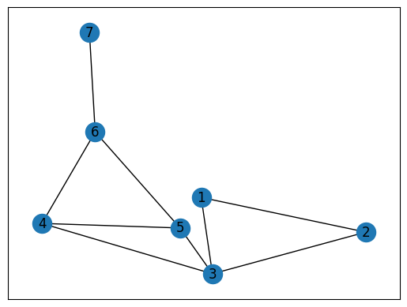
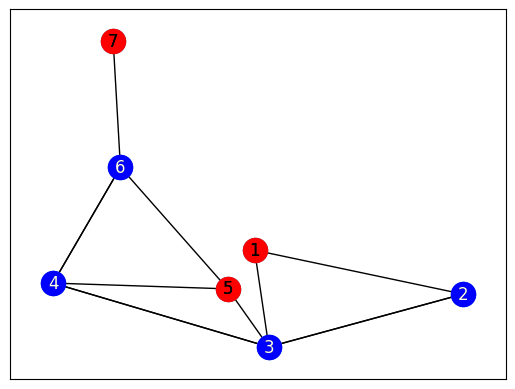
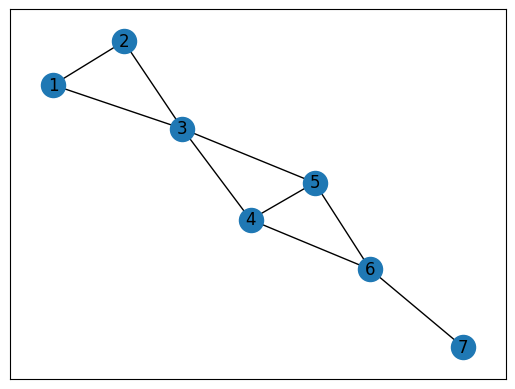
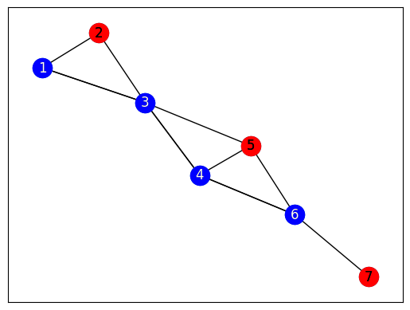
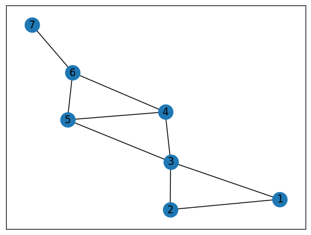
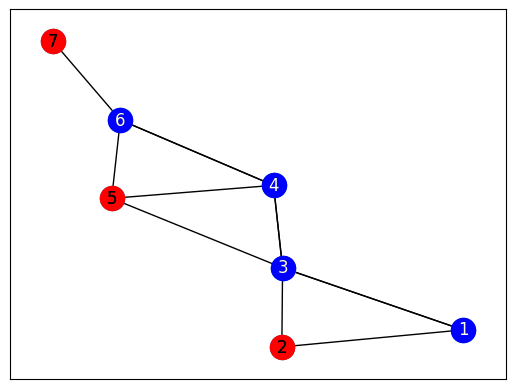

# Graph Mapping

The Ocean program uses the package ``dwave-networkx``.  D-Wave NetworkX is an extension of NetworkX—a
Python language package for exploration and analysis of networks and network
algorithms—for users of D-Wave Systems.  The base problem of this exercise is
the antenna selection problem from the [D-Wave Collection of
Examples](https://github.com/dwave-examples/antenna-selection).

## Exercise 1
Open ``change_sampler.py``.  This file is identical to ``original_program.py``,
but does not have a sampler defined.  Set up your sampler in the
``set_sampler`` function to run the simulated annealing algorithm.

Note:  Don't forget to import the package where the sampler lives.  You may
find the [Ocean documentation](https://docs.ocean.dwavesys.com/en/stable/)
useful.

## Running ``change_sampler_solution.py``. 
The output is as follows:

---

Maximum independent set size found is 3

[1, 5, 7]

Your plots are saved to simulated_annealing_original.png and simulated_annealing_solution.png

---

#### Original

#### Solution

A second alternate output is as follows:

---

Maximum independent set size found is 3

[2, 5, 7]

Your plots are saved to simulated_annealing_original.png and simulated_annealing_solution.png

---

#### Original

#### Solution

A third alternate output is as follows:

---

Maximum independent set size found is 3

[2, 5, 7]

Your plots are saved to simulated_annealing_original.png and simulated_annealing_solution.png

---

#### Original

#### Solution

