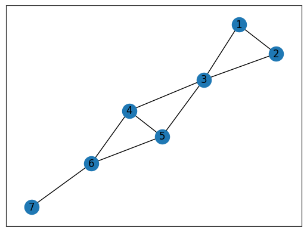
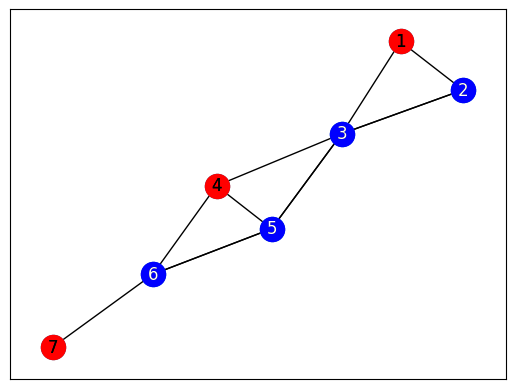
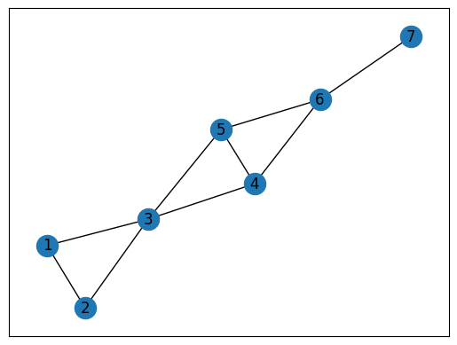
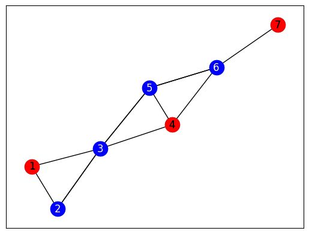

# Graph Mapping

The Ocean program uses the package ``dwave-networkx``.  D-Wave NetworkX is an extension of NetworkX—a
Python language package for exploration and analysis of networks and network
algorithms—for users of D-Wave Systems.  The base problem of this exercise is
the antenna selection problem from the [D-Wave Collection of
Examples](https://github.com/dwave-examples/antenna-selection).

## Running ``original_program.py``. 
The output is as follows:

---

Maximum independent set size found is 3

[1, 4, 7]

Your plots are saved to antenna_plot_original.png and antenna_plot_solution.png  

---

#### Original

#### Solution

#### Alternate Original

#### Alternate Solution

